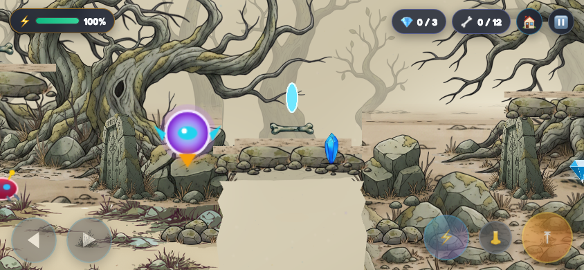
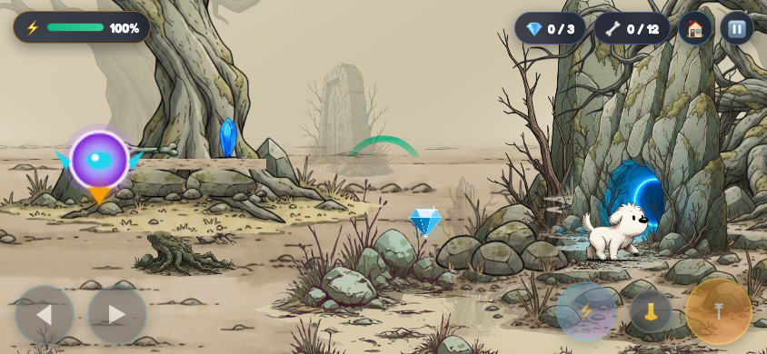

# Woodland banks and cave entry

Level 1 ravines now reveal the same woodland background as their surroundings. Removed the opaque rectangular pit panels and replaced the stretched wall images with whole, proportionate painted rock stacks and peaks. Existing energy shots, gaps and collisions remain.

Cave entry previously moved the dog below the whole cave sprite immediately, hiding it before it reached the opening. Entry now keeps the dog in front of the artwork during an 850 ms walk to the doorway, then spends 500 ms receding inside and 350 ms fading out. Feet stay on the ground during the approach. Physics is disabled during this controlled animation to prevent collision jitter. This shared entry fix applies to all levels.

Validation: all four static level-layout checks passed. Browser entry checks verify an opaque, visible dog above the cave's render depth during approach, followed by recession at the doorway and eventual disappearance. No new traversal geometry was introduced.

