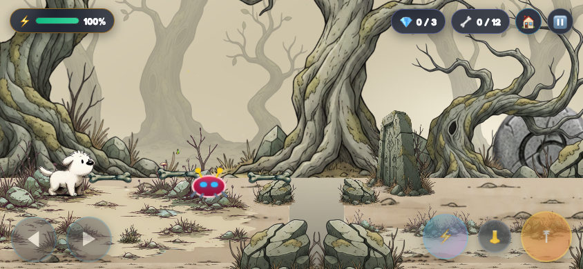
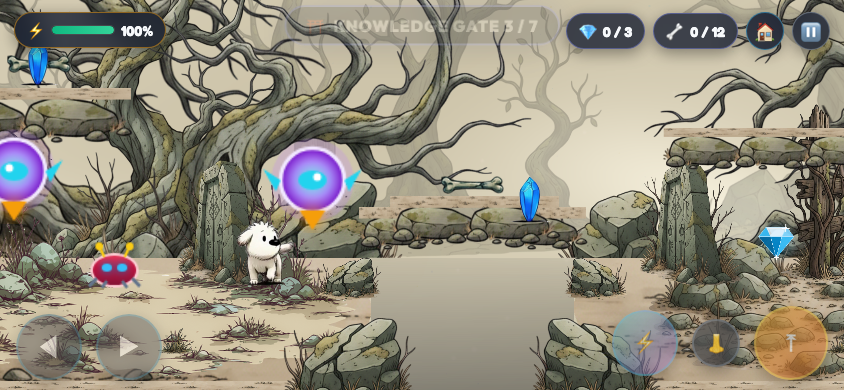
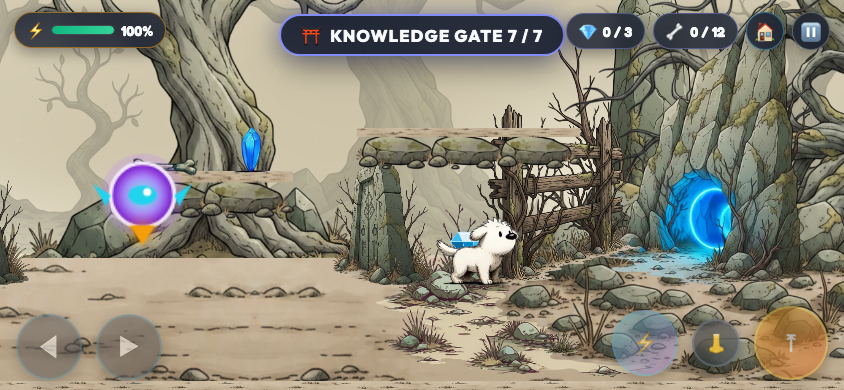
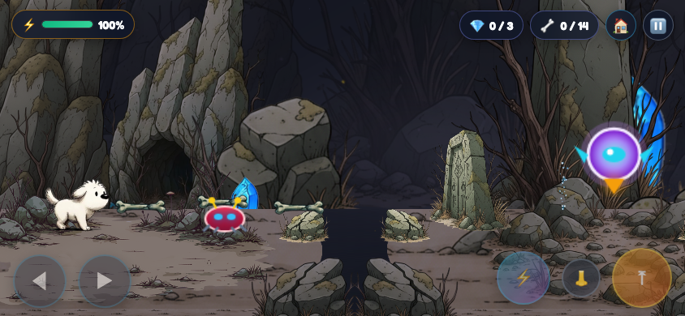
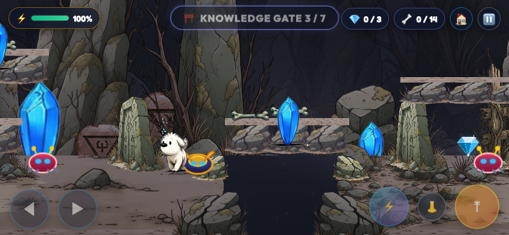
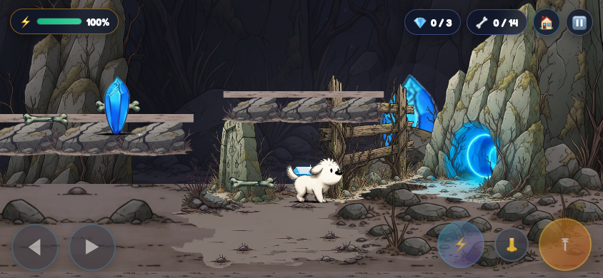
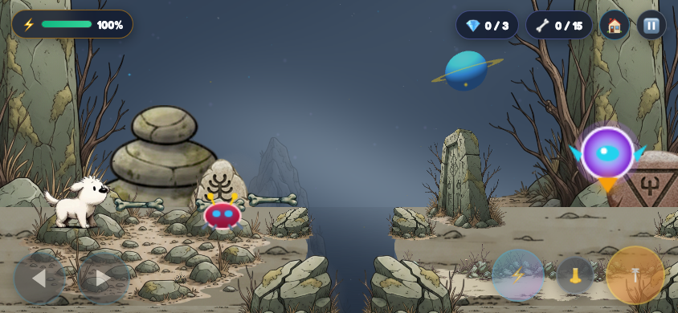
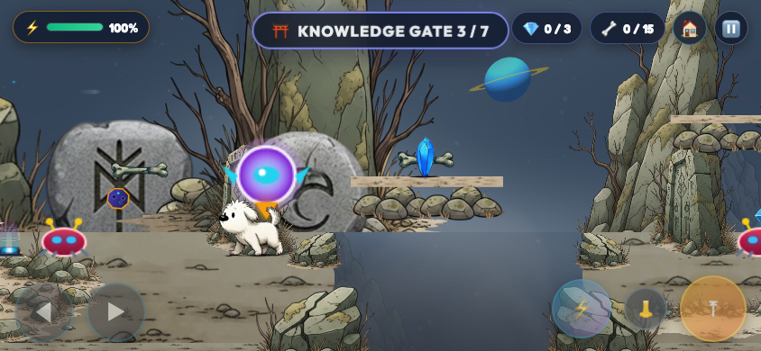
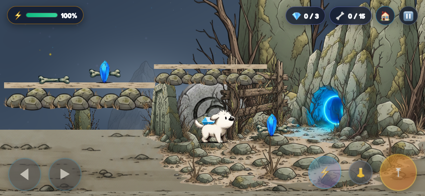

# Illustrated level redesign — 21 September 2026

Levels 1–3 now use authored scenery compositions from the supplied pack: pale twisted-tree woodland, enclosed crystal caverns, and open summit ruins. Existing combat, quizzes, seven gates, three diamonds, and seven enemies per level remain. Level 4 retains its Moonmoss design.

## Asset audit and use

Inspected the original `2D Stylized Adventure Game Asset Pack/Enviroment` trees, rocks, ground, tiles, rune stones and related animation assets. [Existing asset contact sheet](../artifacts/illustrated-redesign/asset-audit.jpg) · [Original rock/tree audit](../artifacts/illustrated-redesign/source-rock-audit.jpg).

Four tree silhouettes plus the grove create varied framing. Shelves, low piles, cairns, peaks and spires provide banks, platform supports, cavern walls and summit landmarks. Painted earth tiles and irregular ground patches provide the walking plane; the original painted platform strip provides the rocky lip. Existing rune_spiral, rune_tablet, rune_pillar and rune_arch are engraved standing stones, not architectural arches. The asset named cavern_rock is a stone hollow. Assets named cloud_platform/platform_stone are soil textures, so they were not presented as cloud artwork. Existing animated grass includes dry plant silhouettes; butterflies, bubbles and flies are retained sparingly. Crystal clusters provide localized cavern glow. Existing sky/cloud effects supply summit atmosphere; no new generated art was needed.

New optimized pack assets (source paths relative to Enviroment):

| Output under assets/adventure/illustrated | Original source |
|---|---|
| `ancient_tree.png` | `Trees/Tree_1.png` |
| `fork_tree.png` | `Trees/Tree_2.png` |
| `root_tree.png` | `Trees/Tree_3.png` |
| `arch_tree.png` | `Trees/Tree_4.png` |
| `distant_grove.png` | `Trees/Trees.png` |
| `rock_stack.png` | `Rocks/Rock_2.png` |
| `rock_shelf.png` | `Rocks/Rock_4.png` |
| `rock_spire.png` | `Rocks/Rock_6.png` |
| `rock_peak.png` | `Rocks/Rock_5.png` |
| `rock_low.png` | `Rocks/Stone_3.png` |
| `rock_cairn.png` | `Rocks/Stone_9.png` |
| `rock_upright.png` | `Rocks/Stone_10.png` |
| `earth_a.png` | `Tile/Ground_A.png` |
| `earth_b.png` | `Tile/Ground_B.png` |

Existing ground_1/3/4/5, ground_cavern, mossy_rock, platform, cave_anim, rune stones, crystal_cluster and ambient sprite sheets are reused. All scenery positions are explicit in illustrated_levels.js; no random scenery scatter is used.

## Section-by-section layout and landmarks

Each row ends at its existing numbered gate. World x is the primary landmark position; other rocks, roots and scenery support it. Optional routes retain bones and crystals, with the three existing diamonds preserved.

### Level 1: Moonlight Plains

| Section | Primary landmark | Composition / traversal |
|---|---|---|
| 1. Oldroot Clearing | `ancient_tree` at x=70 | Large trees frame a calm painted-earth introduction. |
| 2. Rune Brook Crossing | `rune_spiral` at x=1090 | Carved stone and rocky banks frame the first crossing and optional steps. |
| 3. Whispering Grove | `arch_tree` at x=2140 | Branch canopy frames a shared upper collectible shelf and the relocated fly patrol. |
| 4. Broken Root Bridge | `root_tree` at x=2510 | Root and shelf formations support the bridge crossing. |
| 5. Fallen Stone Hollow | `rock_stack` at x=3400 | Large stacked rocks anchor the collapsing-stone gap. |
| 6. Twilight Rootway | `ancient_tree` at x=4160 | Trees support a broad upper route over the thorn section. |
| 7. Moonlit Grove Gate | `fork_tree` at x=5010 | Shared ascent, tree-framed arrival court and cave destination. |
### Level 2: Crystal Caverns

| Section | Primary landmark | Composition / traversal |
|---|---|---|
| 1. The Cavern Mouth | `cave_anim` at x=280 | Cave mouth and massive rock walls establish the enclosed biome. |
| 2. Amethyst Lantern Chamber | `crystal_cluster` at x=1080 | Local crystal glow lights the crossing without a global cyan wash. |
| 3. The Crystal Shaft | `rock_peak` at x=2250 | A lower step connects to the upper shaft shelf. |
| 4. Falling Stone Narrows | `rune_tablet` at x=2490 | Carved stone and narrow rock framing identify the traversal beat. |
| 5. The Deep Lift | `crystal_cluster` at x=3890 | Existing lift crosses a deep rock-walled chamber with a crystal landmark. |
| 6. Chamber of Old Runes | `rune_spiral` at x=4270 | A large carved rune anchors the upper collectible route. |
| 7. The Silver Tunnel | `crystal_cluster` at x=5730 | Merged final shelf leads into a crystal-framed tunnel destination. |
### Level 3: Starlight Summit

| Section | Primary landmark | Composition / traversal |
|---|---|---|
| 1. Skyward Cairns | `rock_cairn` at x=280 | Cairns and monoliths introduce the open sky and cliff edge. |
| 2. Suspended Stone Crossing | `rock_spire` at x=1030 | Suspended rock crossing has clear landing banks. |
| 3. The Wind Terrace | `rune_arch` at x=2270 | Wind moved here to create the intended open terrace beat. |
| 4. Ruins Above the Clouds | `rock_spire` at x=2520 | Tall monoliths and carved stones frame the highland traversal. |
| 5. Crumbling Sky Ledge | `rock_peak` at x=3400 | Collapsing stones cross a deep gap with clouds below. |
| 6. The High Sanctuary | `rune_pillar` at x=4470 | Existing-type vertical lift, broad upper shelf and gentle wind combine. |
| 7. Gateway of the Constellations | `rock_spire` at x=5750 | Grand spire and rune framing lead to a supported cave arrival court. |

## Terrain, caves and readability

The main earth plane uses painted pack textures, foreground patches and rocky cliff faces. Masks prevent scenery bases from covering the trenches. Irregular bank edges and darkened drops separate safe ground from pits. Upper ledges use whole overlapping rock silhouettes, with roots or spires supporting shelves over solid ground. Static optional platforms decrease from 10 to 7 in Level 1 and 6 to 4 in Level 3; Level 2 retains six with a better shaft step. Platform categories remain 120/240/420 world pixels wide.

All three exit caves face the left-hand approach (`flipX: true`), use scale 0.85, and align their opaque floor row 462 of 470 to the physical ground. The cavern entrance landmark is also flipped toward the approach. Arrival courts include nearby rocks, tree/spire framing and restrained glow. Dog paws, collision body, cave floors and ledge surfaces align in the automated surface check across all four levels.

Distant desaturated silhouettes, large midground framing and a clear playable foreground establish depth. Vegetation sits mostly below the walking band. The woodland sky is warm and pale like the reference; cavern stars are intentionally obscured by enclosure. Summit clouds drift below cliffs, with cosmic sky visible above. Animated atmosphere remains viewport-filling.

## Mobile verification and compromises

Uninterrupted automated touch-control playthroughs completed all three redesigned levels with seven gates, three diamonds, 100% final energy and zero falls each. Optional-route checks collected every bone/crystal with enemies disabled to isolate reachability; full playthroughs retained enemies. Cavern and summit component checks passed moving-platform rides, collapse warning/reset, geysers, safe checkpoints, touch input and resize behavior. Static layout checks passed all four levels. Final nine screenshots reported no script errors or failed assets.

The main collision ground remains at the existing constant baseline; vertical variation comes from supported upper paths, lifts and trenches rather than a new slope-physics system. Painted ground has perspective depth around that baseline. Floating shelves retain level-platform silhouettes, especially in the cavern, rather than matching a continuous illustrated landscape exactly. All 21 scenes have authored landmarks, but long ground spans still reuse seamless earth textures. No new gameplay system was introduced.

Testing used an 844×390 touch viewport and software SwiftShader rendering, not a physical phone. Full-playthrough averages were approximately 17.6–18.3 FPS in that software environment; physical-device performance remains unverified. This is a visual/layout pass, not a claim of 60 FPS mobile certification.

## Screenshots

### Level 1: Moonlight Plains

### Level 2: Crystal Caverns

### Level 3: Starlight Summit

## Exact changed files

- `scripts/adventure_game.js`: terrain/art rendering, integration and layout adjustments.
- `scripts/illustrated_levels.js`: new authored 21-section scenery profiles.
- `scripts/process_redesign_assets.py`: reproducible optimization of source pack artwork.
- `scripts/build_game.py`: includes scenery profiles in the generated game.
- `index.html`: regenerated playable build.
- `sw.js`: cache version advanced to v6-illustrated.
- `scripts/test_adventure_layout.cjs`: reads authored profiles with level configuration.
- `scripts/test_adventure_browser.cjs`: configurable QA output/levels and biome-appropriate visibility assertion.
- `scripts/test_adventure_routes.cjs`: isolates collectible reachability from enemy knockback.
- `assets/adventure/illustrated/manifest.json` and the fourteen PNG files listed above.
- `docs/ILLUSTRATED-REDESIGN.md`: this report.

Evidence files under `artifacts/illustrated-redesign/`:

- `alignment.json`
- `asset-audit.jpg`
- `components-mobile.json`
- `level-1-exit-mobile.png`
- `level-1-middle-mobile.png`
- `level-1-playthrough-mobile.png`
- `level-1-start-mobile.png`
- `level-2-exit-mobile.png`
- `level-2-middle-mobile.png`
- `level-2-playthrough-mobile.png`
- `level-2-start-mobile.png`
- `level-3-exit-mobile.png`
- `level-3-middle-mobile.png`
- `level-3-playthrough-mobile.png`
- `level-3-start-mobile.png`
- `optional-routes.json`
- `playthrough-mobile.json`
- `source-rock-audit.jpg`
- `visual-mobile.json`
