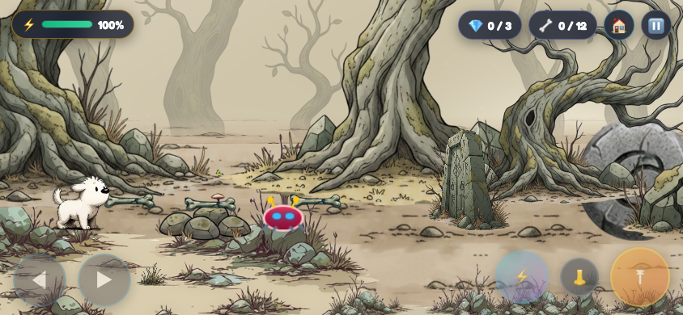
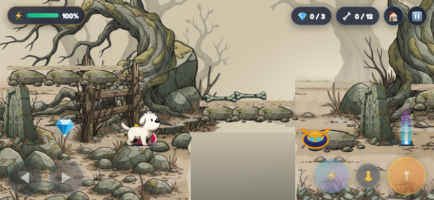
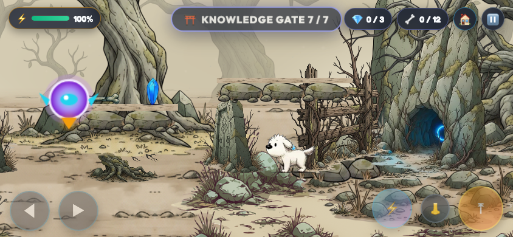

# Level 1 forest-floor revision

This revision responds to the reference image’s broad ground plane and embedded tree roots. It changes Level 1 only.

- Replaced the thin terrain strip and full-width rock rim with a deep painted earth surface extending below the viewport.
- Moved the tree roots behind the walking line and rendered soil below them, so the root silhouettes remain visible instead of being clipped by foreground strips.
- Feathered the rear earth transition and removed repeated foliage strips.
- Removed the opening tutorial pit to create a continuous introductory grove. Later traversal gaps remain.
- Kept seven gates, three diamonds, existing enemies, controls and combat.

Changed sources: `scripts/adventure_game.js` and generated `index.html`. Evidence is under `artifacts/level1-forest-floor/`. Main collision height remains unchanged; the deep foreground is perspective scenery.

## Preview

