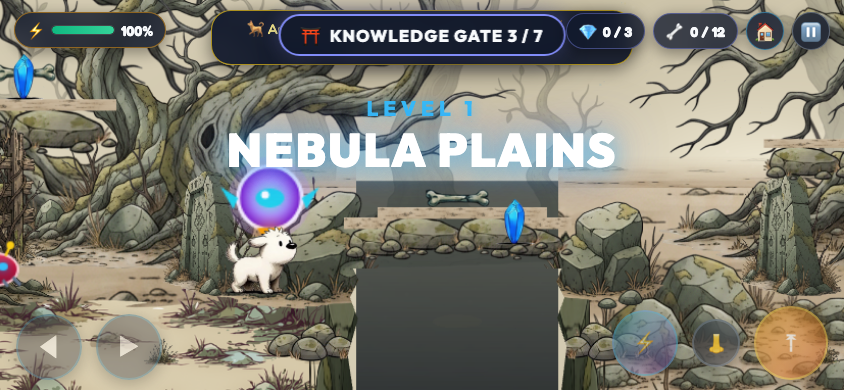
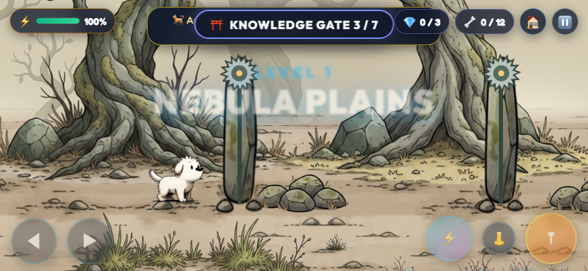

# Level 1: longer woodland and timed traps

- Length increased from 5,900 to 7,300 world pixels (24%). The additional grove contains two cutter pillars, framing trees, resting space and the relocated final ascent/exit.
- All three ravines have shaded depths, rock-lined banks and low rock dressing blending their edges with the forest floor.
- Each ravine emits an upward energy projectile: 1-second warning pulse, 0.9-second shot window, then a safe interval in a 4.6-second cycle. Emitters are staggered. Shots deal 8 energy damage using the existing shield/invulnerability pipeline.
- Two rotating cutters travel vertically on stone pillars. They have a long raised rest, a warning, a descent, a low hold and retraction. Each deals 8 damage; there is safe waiting ground on both sides.
- Post-gap gates now sit 300–320 pixels beyond the landing edge. One patrol moved away from the new recovery point.
- Seven gates and three diamonds remain. Levels 2–4 are unchanged.

## Verification

Static layout checks passed all four levels, including safe checkpoints. A full automated Level 1 touch playthrough reached the moved exit with seven gates, three diamonds and no falls. Separate trap-phase checks verified warning/active/safe projectile windows, 220-pixel cutter travel and full retraction, plus gate clearance. No browser script errors occurred in that check. Final ravine shading is a visual-only adjustment after the full playthrough.

Software-rendered test performance was approximately 8 FPS while concurrent browser checks ran; real-device smoothness is not verified. The automatic playthrough demonstrates one successful timing sequence, not exhaustive timing coverage.

Files: `scripts/adventure_game.js`, generated `index.html`, `scripts/test_woodland_traps.cjs`, this report and evidence under `artifacts/level1-traps/`.
